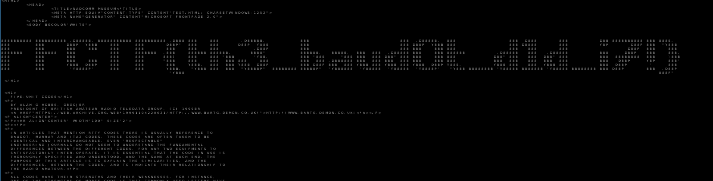

# NADCOMMMuseum 
Users are provided with file evidence.flac\
The challenge description reads:\
\
"There's been a murder, and we need to solve it. We've just received a critical communication... from the PAST?!\
Help us decode this. We know the killer is from the mid 19th century, but somehow he got a hold of a Bell 202! We need to know what it says to crack this case!"\
\
Armed with this information we gather what we can about Bell 202. Wikipedia lets us know it useds AFSK1200 / AFSK2400\
The description tells us the killer is from the mid 19th century which turns out to be a huge hint.\

## Solve
Using `minimodem` we run the following command: 
```bash
minimodem -5 -M 1200 -S 2400 -q -f evidence.flac 1200
```
we use the flag 5 to specify baudot output. We are returned an html file that reads the flag in ascii art (see picture)

